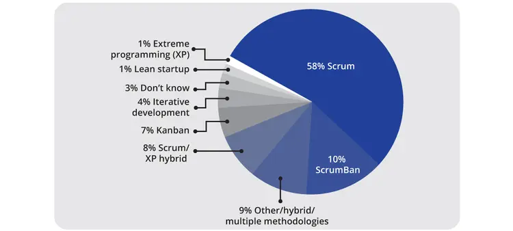
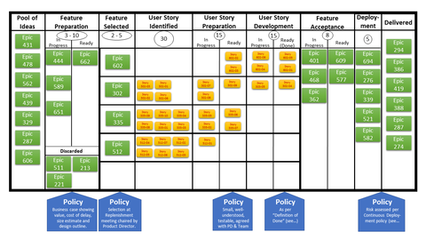

# Agile Methodologies that aren't Scrum

## Agile is not just Scrum

Only having tangentially encountered the Agile philosophy in my previous jobs, I didn't think about the difference between "Scrum" and "Agile" besides being two words that I had only a vague understanding of, and considered to be functionally interchangeable.

I suspect this is an attitude that true Agile disciples encounter frequently, and probably hate.

In short, Agile is a philosophy, while Scrum is a system for practical implementation of Agile's principles. Agile is a broad philosophy with many possible implementations. Scrum is just one of the most popular frameworks within the Agile family.

In fact, there are several other ways to implement Agile principles that I was interested to learn about.

### Although, for most people, Agile is Scrum actually

According to the State of Agile 2024, Scrum is by far the most commonly implemented Agile methodology. 58% report using Scrum, where 10% report using ScrumBan, and 8% Scrum/XP hybrid, the latter two being Scrum variants.

In other words, many ill-informed people like me might be forgiven for conflating the two. For the vast majority of people, Scrum is their only window into Agile ideas.

## So what else is there?

I wanted to understand the other main ways to implement Agile ideas, and I looked into Kanban and Extreme Programming (XP)

## Kanban

Kanban has its roots in lean manufacturing philosophies. The origins lie in the systems developed at Toyota in the late 1940's to produce "just in time" dynamically to meet demand. Eventually it was realized that this system could be useful in organizations besides car manufacturing, and Kanban was adapted into a system for software development.

### How is Kanban different from Scrum?

- Kanban is operated as a continuous "flow", as opposed to the "sprints" of Scrum. There are no fixed length cycles, and it is meant to be a continuously operating system. While Scrum likes to make a sprint plan, and then attempt to not deviate from it during the sprint, Kanban is more open to change at any time

- Kanban doesn't prescribe roles or ceremonies. There are no "Scrum Masters" or "Product Owners", nor are there any "daily stand-ups" or "sprint plannings"

## Extreme Programming

Extreme Programming (XP) is the child of Kent Beck in 1996, from his work at Chrysler *(so many connections to car companies in this world, for some reason. I guess that was just the hotbed of business process innovation for a while)*

The focus of XP is on the engineering practices itself, focusing on frequent short-term iterations with frequent iteration. XP highly values test-driven development and pair programming.

### How is XP different from Scrum?

- XP operates in iterations that, while time limited like Scrum (as opposed to Kanban's continuous flow) are normally shorter than Scrum's sprints.

- XP focuses on having software deliverables very frequently. Maybe even daily.

- XP does not have the same leadership requirements or roles as Scrum. For example, there may be a customer representative embedded in the team, but he is not a "product owner".

## Scrum Hybridization

Since Scrum is so prevalent in the industry, it seems hard to escape its pull. Engineering teams that desire some of the "flavor" of Kanban or XP often adopt hybrid systems, instead of ditching Scrum altogether.

### ScrumBan

Many teams keep the basic structure and roles of Scrum, but add in elements of Kanban's focus on continuity and flexibility.

For example, instead of very structured sprints and sprint planning sessions, a team might have an occasional planning session or a short retrospective at any time, instead of waiting for a sprint to begin or end.

A ScrumBan engineer will take much directive from the Kanban board, and let WIP limits guide the next tasks on deck after one finishes.

### Scrum/XP

Teams might gravitate towards a Scrum / XP hybrid if they want to focus on the engineering practices and quality of the code itself.

Many Scrum / XP hybrids retain the framework of Scrum, but emphasizing the practices of XP. For example, a Scrum/XP team may still have daily stand-ups and sprint plannings, but their sprints may be shorter. Daily work will be test-driven, focusing on pair programming and daily deliverables